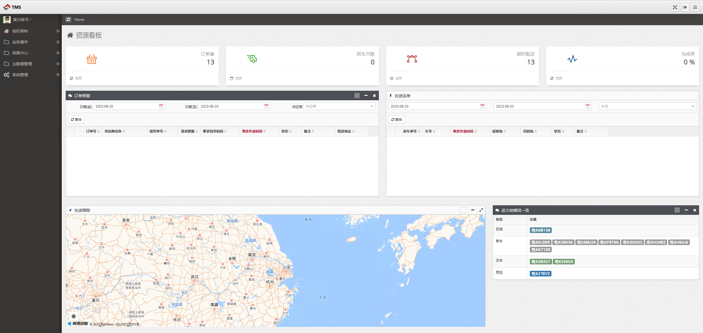

# TMS

This Transportation Management System (TMS) provides an all-inclusive platform designed to efficiently manage and oversee your entire transportation logistics process. With a user-friendly interface, our TMS allows for streamlined coordination and control of your transportation operations from end to end. Here are the core business modules that make up our TMS offering:

## Demo
- user name: demo@email.com
- password: 123456

1. **Carrier Information:** Keep track of all your carriers, including their contact details, capabilities, and rates. Compare carriers to find the best fit for your transportation needs, and use the system to automatically select the most cost-effective carrier for each shipment.

2. **Transportation Planning:** Create efficient transportation plans that optimize routes, schedules, and carrier selection. Our TMS supports multi-leg and multi-modal transportation, allowing you to plan complex shipments across various modes, such as truck, rail, air, and ocean.

3. **Dispatch Orders:** Streamline your dispatching process by creating and issuing dispatch orders directly within our TMS. Automatically generate orders based on your transportation plans, and send them electronically to your carriers. Monitor the status of each order in real-time, and ensure timely and accurate deliveries.

4. **Attachment Management:** Easily manage all your transportation-related documents in one place. Upload, store, and organize your documents such as bills of lading, invoices, and proof of delivery. Retrieve them quickly whenever needed, and share them securely with authorized parties.

5. **Video Surveillance:** Enhance the security and visibility of your shipments with our integrated video surveillance module. Monitor your shipments in real-time through video feeds, and receive alerts for any unusual activities or potential threats.

6. **Financial Settlement:** Simplify your financial processes with our automated settlement module. Track your expenses and revenue for each shipment, generate accurate invoices, and automate your payments to carriers. Our system integrates with your existing accounting software, making it easy to reconcile your accounts and ensure financial accuracy.

With our TMS, you can streamline your transportation processes, reduce costs, and improve customer satisfaction. Whether you're a small business or a large enterprise, our TMS is designed to meet your unique transportation needs. Contact us today to learn more about how our TMS can transform your transportation operations."

Please note that this description is generic and can be customized based on the specific features and benefits of your TMS system.
